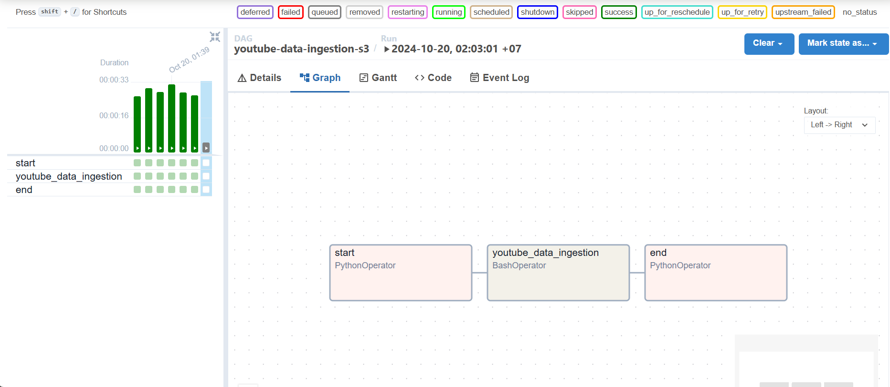
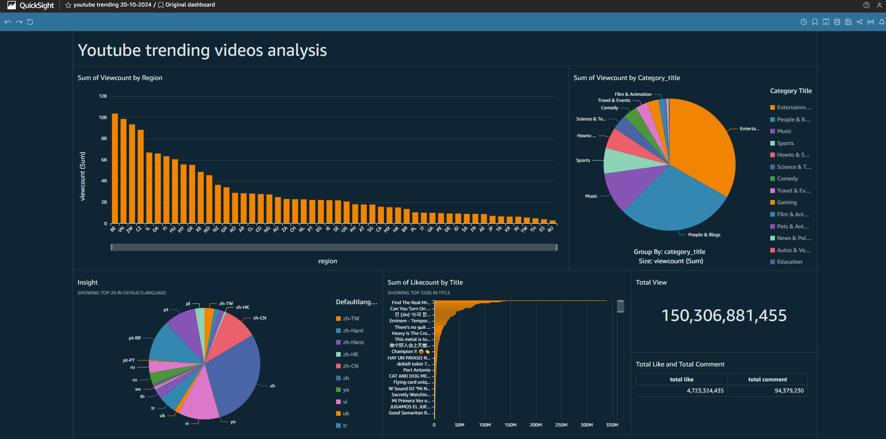

# Youtube trending videos data with Airflow and AWS tools 
## About Project
My project is an automated pipeline that collects trending video data from multiple countries using the YouTube API, managed by Airflow. The data is stored in an S3 data lake, where a Lambda function is triggered to clean the data and load it into AWS Glue for processing. Finally, the transformed data is made available for analysis in QuickSight.

## Technical Structure
The project is architected to showcase a modern data engineering stack, comprising:

1. **Apache Airflow:** Orchestrates the data extraction, managing tasks from data extraction to loading into the data lake.
2. **PostgreSQL:** Serves as the metadata database for Airflow, tracking job statuses and logs.
3. **PgAdmin:** Provides a web-based interface for PostgreSQL database administration.
4. **Docker:** Containers encapsulate each component of the stack for ease of deployment and isolation.
5. **Integration with AWS S3, Lambda, Glue and quicksight** demonstrates the project’s cloud-native approach, enabling scalable data storage and sophisticated analytics.

## Prerequisites

Before deploying the project, the following prerequisites are necessary:

- Docker and Docker Compose: For running the containerized environment.
- A AWS account: To access Amazon cloud services such as S3, Glue, Athena, Lambda and quicksight.

## Deployment images
### airflow graph

### s3 

### lambda 
[lambda-trigeers-clean-data.py](./lambda-funtions/youtube-trending-function-raw-data-trigger.py) 

 

[lambda-trigger-glue-job.py](./lambda-funtions/lambda-trigger-glue-job.py) 

### glue 

### quicksight 

